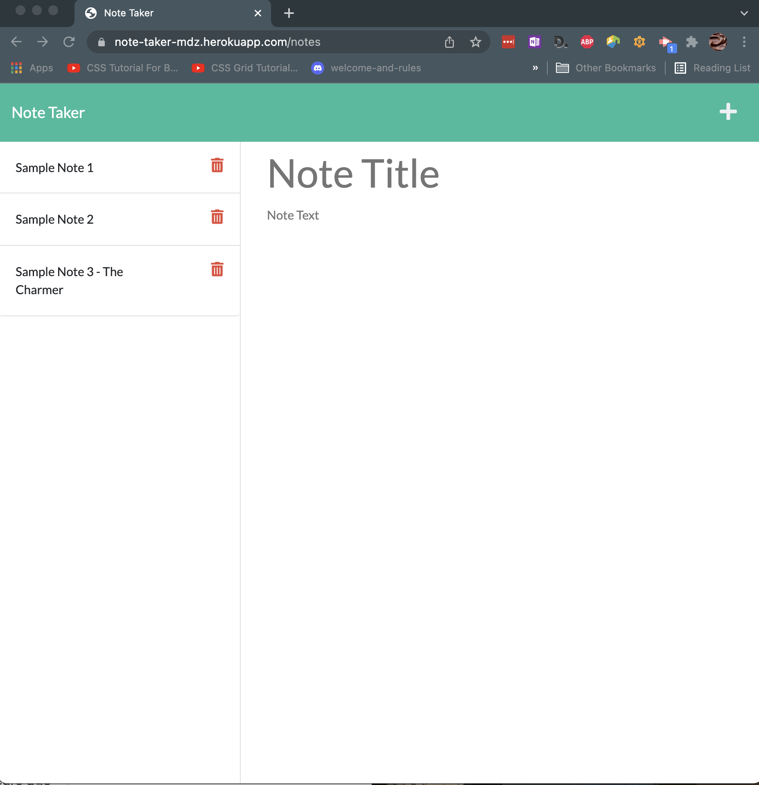

# **Note Taker**
&nbsp;

&nbsp;

## **Project Description**
***
 Use this on-line app to jot down your to-do list, story board ideas or future project names! Though it was developed with entrepreneurs in mind, it's straight forward, no-frills approach to note taking appeals to many! Whatever you want to remember - write and save your note here with Note-Taker. 

&nbsp;

## Table of Contents
***
* [Installation](#installation)
* [Usage](#usage)
* [URL](#url)
* [Screenshot](#screenshot)
* [Contributing](#contributing)
* [Tests](#tests)
* [Resources](#resources)
* [Questions](#questions)
* [License](#license)

&nbsp;

## **Installation**
***
Clink this [link](https://note-taker-mdz.herokuapp.com/) or the one further down in this README to access the app. Repo here on GitHub and it's deloyed through Heroku.

&nbsp;

## **Usage**
***
Use link in README to navigate to the Heroku deployed app. Once there, click Get Started button and your off! Each note is displayed on the left. Empty fields are on the right; add Note button is in the upper right. Save button appears in the top right, after you jot some text in the note body. Delete buttons in-line with each note.

&nbsp;

##### If you want to check out backend code in action on your local evironment: 

Ensure you have Node installed. Fork the repo. Clone to local directory. Install dependencies: npm package & related packages, Express, uniqid. (Review package.json for list and individual package docs for installation details.)  If needed, from command line, in the main program directory, type: npm install. Program runs from server.js file: from command line, in the main program directory, type: node server. 

&nbsp;

## **URL**
***
[Note Taker on Heroku](https://note-taker-mdz.herokuapp.com/)

&nbsp;

## **Screenshot**
***

&nbsp;

### **Contributing**
***
Not accepting contributors.

&nbsp;

### **Tests**
***
No tests at this time.

&nbsp;

### **Resources**
***
#### I used or Was Inspired By:
https://expressjs.com/en/api.html#app.delete.method

https://github.com/MellieDee/readMe-generator

https://developers.suitecommerce.com/

https://developers.suitecommerce.com/troubleshooting-uncaught-syntaxerror-unexpected-token-u-in-json-at-position-0.html

https://www.geeksforgeeks.org/node-js-fs-writefile-method/

https://careerkarma.com/blog/typeerror-cannot-read-property-length-of-undefined/

https://www.w3schools.com/js/js_array_methods.asp

&nbsp;

### **Questions**
***
Reach me directly at  mongabay00@outlook.com    
Or checkout out my GitHub profile:  [github.com/melliedee](https://github.com/melliedee)

&nbsp;

### **License**
***
Copyright (c) Mellie Dee. 

Licensed under the [MIT](https://choosealicense.com/licenses) license.
    
&nbsp;
      
 

##### Return to:
***
* [Installation](#installation)
* [Usage](#usage)
* [URL](#url)
* [Screenshot](#screenshot)
* [Contributing](#contributing)
* [Tests](#tests)
* [Resources](#resources)
* [Questions](#questions)
* [License](#license)

&nbsp;

